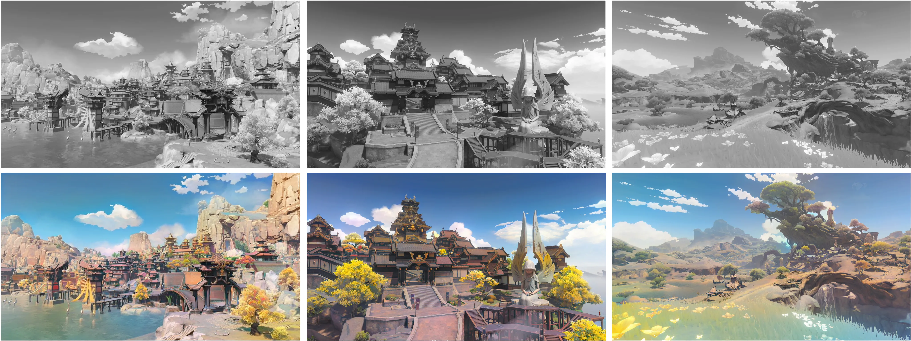

# 🎨 DDColor

[](https://arxiv.org/abs/2212.11613)
[](https://huggingface.co/piddnad/DDColor-models)
[](https://www.modelscope.cn/models/damo/cv_ddcolor_image-colorization/summary)
[](https://replicate.com/piddnad/ddcolor)


Official PyTorch implementation of ICCV 2023 Paper "DDColor: Towards Photo-Realistic Image Colorization via Dual Decoders".

> Xiaoyang Kang, Tao Yang, Wenqi Ouyang, Peiran Ren, Lingzhi Li, Xuansong Xie
> *DAMO Academy, Alibaba Group*

🪄 DDColor can provide vivid and natural colorization for historical black and white old photos.

<p align="center">
  
</p>

🎲 It can even colorize/recolor landscapes from anime games, transforming your animated scenery into a realistic real-life style! (Image source: Genshin Impact)

<p align="center">
  
</p>

---

## 📋 目录

- [在线体验](#在线体验)
- [安装（Windows / Linux / macOS）](#安装windows--linux--macos)
- [快速开始](#快速开始)
- [常见问题](#常见问题)
- [Model Zoo](#model-zoo)
- [训练](#训练)
- [ONNX 导出](#onnx-export)
- [引用](#citation)
- [致谢](#acknowledgments)

---

## 在线体验

| 平台 | 链接 |
|------|------|
| ModelScope | [在线 Demo](https://www.modelscope.cn/models/damo/cv_ddcolor_image-colorization/summary) |
| Replicate | [在线 Demo](https://replicate.com/piddnad/ddcolor) |
| Hugging Face | [模型下载](https://huggingface.co/piddnad/DDColor-models) |

---

## 安装（Windows / Linux / macOS）

### 环境要求

- **Python**: 3.7 ~ 3.10（推荐 3.9）
- **PyTorch**: >= 1.7（推荐 2.x + CUDA）
- **GPU**: 显存 >= 4GB（推荐 6GB+）

### 1. 创建虚拟环境

```bash
# conda（推荐）
conda create -n ddcolor python=3.9
conda activate ddcolor

# 或者用 venv
python -m venv venv
venv\Scripts\activate    # Windows
source venv/bin/activate # Linux/macOS
```

### 2. 安装 PyTorch

```bash
# CUDA 11.8
pip install torch==2.2.0 torchvision==0.17.0 --index-url https://download.pytorch.org/whl/cu118

# CPU only（不推荐，极慢）
pip install torch torchvision
```

### 3. 安装依赖

```bash
pip install -r requirements.txt
```

### 4. 下载模型权重

> 模型权重约 800MB，不包含在 Git 仓库中。请选择以下任一方式下载：

**方式 A：自动下载（推荐）**

```bash
python run_colorization.py
```
脚本会自动从 ModelScope 下载模型到 `modelscope/` 目录。

**方式 B：手动下载**

```python
from modelscope.hub.snapshot_download import snapshot_download
model_dir = snapshot_download('damo/cv_ddcolor_image-colorization', cache_dir='./modelscope')
```

**方式 C：从 Hugging Face 下载**

```bash
# 安装 huggingface-hub 后
python -c "
from huggingface_hub import snapshot_download
snapshot_download('piddnad/ddcolor_modelscope', local_dir='./models')
"
```

---

## 快速开始

### 命令行推理

```bash
# 单张图片
python scripts/infer.py --model_path ./modelscope/damo/cv_ddcolor_image-colorization/pytorch_model.pt --input ./my_photo.jpg --output ./results

# 整个文件夹
python scripts/infer.py --model_path ./modelscope/damo/cv_ddcolor_image-colorization/pytorch_model.pt --input ./my_images --output ./colored

# 通过 Hugging Face 模型名（自动下载）
python scripts/infer.py --model_name ddcolor_modelscope --input ./my_photo.jpg
# 可选模型名: ddcolor_paper | ddcolor_modelscope | ddcolor_artistic | ddcolor_paper_tiny

# 使用 tiny 模型（更快、显存更低）
python scripts/infer.py --model_name ddcolor_paper_tiny --input ./my_photo.jpg
```

### 推理参数说明

| 参数 | 说明 | 默认值 |
|------|------|--------|
| `--model_path` | 本地模型权重路径 | - |
| `--model_name` | Hugging Face 模型名 | - |
| `--input` | 输入图片路径或文件夹 | `assets/test_images` |
| `--output` | 输出路径 | `results` |
| `--input_size` | 模型输入尺寸（越大越精细但越慢） | `512` |
| `--model_size` | 模型大小（配合 `--model_path` 使用） | `large` |

### Python API

```python
import torch
from ddcolor import DDColor, ColorizationPipeline, build_ddcolor_model
from basicsr.utils.img_util import imread, imwrite  # 支持中文路径

# 加载模型
device = torch.device('cuda' if torch.cuda.is_available() else 'cpu')
model = build_ddcolor_model(
    DDColor,
    model_path='./modelscope/damo/cv_ddcolor_image-colorization/pytorch_model.pt',
    input_size=512,
    model_size='large',
    device=device,
)

colorizer = ColorizationPipeline(model, input_size=512, device=device)

# 处理图片
img = imread('./老照片.jpg')           # 支持中文路径
result = colorizer.process(img)
imwrite('./结果.jpg', result)          # 支持中文路径
```

### Gradio Web Demo

```bash
pip install gradio gradio_imageslider
python demo/gradio_app.py
```

浏览器打开 `http://127.0.0.1:7860`。

### ModelScope Pipeline（云端 API）

```python
import cv2
from modelscope.pipelines import pipeline
from modelscope.utils.constant import Tasks
from modelscope.outputs import OutputKeys

img_colorization = pipeline(Tasks.image_colorization, model='damo/cv_ddcolor_image-colorization')
result = img_colorization('https://modelscope.oss-cn-beijing.aliyuncs.com/test/images/audrey_hepburn.jpg')
cv2.imwrite('result.png', result[OutputKeys.OUTPUT_IMG])
```

---

## 常见问题

### Q: 中文文件名图片处理失败？

本仓库已内置修复。`scripts/infer.py` 和 `basicsr/utils/img_util.py` 中的图片读写函数已替换为 Python 原生 `open()` 实现，绕过 OpenCV 在 Windows 上对非 ASCII 路径的限制。

可用测试脚本验证：
```bash
python test_unicode_path.py "你的中文图片.jpg"
```

### Q: 输出结果偏色或不自然？

尝试不同的模型：
- `ddcolor_paper` — 论文原版，色彩保守
- `ddcolor_modelscope` — 通用场景，效果均衡
- `ddcolor_artistic` — 色彩更鲜艳大胆

### Q: 显存不足（OOM）？

1. 使用 tiny 模型：`--model_name ddcolor_paper_tiny`
2. 降低输入尺寸：`--input_size 256`
3. 改用 CPU 推理（极慢）：`device='cpu'`

### Q: 训练环境怎么配？

```bash
pip install -r requirements.train.txt   # 如果存在
python setup.py develop                 # 安装 basicsr 为可编辑包
```

---

## Model Zoo

详见 [MODEL_ZOO.md](MODEL_ZOO.md)。

| 模型 | 适用场景 | 文件大小 |
|------|----------|----------|
| `ddcolor_paper` | 论文原版 | ~800MB |
| `ddcolor_modelscope` | 通用（推荐） | ~800MB |
| `ddcolor_artistic` | 艺术风格 | ~800MB |
| `ddcolor_paper_tiny` | 轻量版 | ~200MB |

---

## 训练

1. **准备数据**：下载 ImageNet 或自定义数据集，运行：
   ```bash
   python scripts/get_meta_file.py
   ```

2. **下载预训练权重**：将 [ConvNeXt](https://dl.fbaipublicfiles.com/convnext/convnext_large_22k_224.pth) 和 [InceptionV3](https://download.pytorch.org/models/inception_v3_google-1a9a5a14.pth) 放入 `pretrain/` 目录。

3. **修改配置**：编辑 `options/train/train_ddcolor.yml`，设置 `meta_info_file` 等参数。

4. **开始训练**：
   ```bash
   sh scripts/train.sh
   ```

---

## ONNX 导出

```bash
# 安装依赖
pip install onnx==1.16.1 onnxruntime==1.19.2 onnxsim==0.4.36

# 导出模型
python scripts/export_onnx.py --model_path pretrain/ddcolor_paper_tiny.pth --export_path weights/ddcolor-tiny.onnx
```

ONNX 推理示例见 [demo/colorization_pipeline_onnxruntime.ipynb](demo/colorization_pipeline_onnxruntime.ipynb)。

---

## 引用

如果这个项目对你的研究有帮助，请引用：

```
@inproceedings{kang2023ddcolor,
  title={DDColor: Towards Photo-Realistic Image Colorization via Dual Decoders},
  author={Kang, Xiaoyang and Yang, Tao and Ouyang, Wenqi and Ren, Peiran and Li, Lingzhi and Xie, Xuansong},
  booktitle={Proceedings of the IEEE/CVF International Conference on Computer Vision},
  pages={328--338},
  year={2023}
}
```

---

## 致谢

感谢 BasicSR 团队提供的优秀训练框架：

> Xintao Wang, Ke Yu, Kelvin C.K. Chan, Chao Dong and Chen Change Loy. BasicSR: Open Source Image and Video Restoration Toolbox. https://github.com/xinntao/BasicSR, 2020.

部分代码参考了 [ColorFormer](https://github.com/jixiaozhong/ColorFormer)、[BigColor](https://github.com/KIMGEONUNG/BigColor)、[ConvNeXt](https://github.com/facebookresearch/ConvNeXt)、[Mask2Former](https://github.com/facebookresearch/Mask2Former) 和 [DETR](https://github.com/facebookresearch/detr)。感谢他们的优秀工作！
