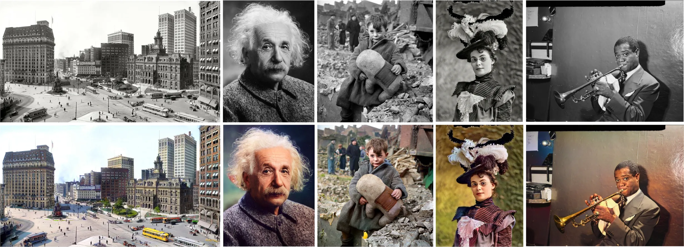

# 🎨 老照片 AI 上色（DeOldify + DDColor）

基于 **DeOldify** 和 DDColor 的图像自动上色工具。支持中文路径、批量处理、GPU 加速。

> 底层框架来自 ICCV 2023 Paper "DDColor: Towards Photo-Realistic Image Colorization via Dual Decoders"
> 及 DeOldify by Jason Antic

🪄 为黑白老照片提供生动自然的色彩还原。

<p align="center">
  
</p>

---

## 📋 目录

- [快速开始（双模型）](#快速开始双模型)
- [模型缓存位置说明](#模型缓存位置说明)
- [DDColor 使用方式](#ddcolor-使用方式)
- [常见问题](#常见问题)
- [引用](#citation)
- [致谢](#acknowledgments)

---

## 快速开始（双模型）

两套模型都保留，可用同一入口切换：

| 模型 | 权重（`models/`） | 说明 |
|------|-------------------|------|
| **DDColor modelscope** | `ddcolor_modelscope.bin` | 开源里较新、通常更自然（默认） |
| **DDColor artistic** | `ddcolor_artistic.bin` | 红斑/脏色往往更少 |
| **DeOldify Stable** | `ColorizeStable_gen.pth` | 经典稳妥，偏旧 |
| **DeOldify Artistic** | `ColorizeArtistic_gen.pth` | 颜色更艳 |
| **DeOldify Video** | `ColorizeVideo_gen.pth` | 视频上色用 |

> 说明：DeOldify 开源权重停在 Artistic / Stable / Video，没有更新版；DDColor 已是 Hugging Face 当前发布的最新权重。

### 下载 / 刷新权重

```bash
venv\Scripts\activate
python download_models.py
```

### 运行上色

```bash
# 把黑白图放进 test_images/ 后：
python zhixing.py --model ddcolor                 # 推荐先试这个
python zhixing.py --model ddcolor-artistic
python zhixing.py --model deoldify --render-factor 22
python zhixing.py --model deoldify-artistic --render-factor 22
python zhixing.py --model both                    # 两套各出一份结果到 results/
```

---

## 快速开始（DeOldify，旧文档）

### 环境要求

- **Python**: 3.7 ~ 3.10（推荐 3.9）
- **PyTorch**: >= 2.1（推荐 2.1 + CUDA 11.8）
- **GPU**: NVIDIA 显卡，显存 >= 4GB（推荐 RTX 4060 8GB）
- **操作系统**: Windows 10/11（也支持 Linux/macOS）

### 1. 安装依赖

```bash
# 创建虚拟环境（推荐）
python -m venv venv
venv\Scripts\activate

# 安装 PyTorch（CUDA 11.8 版本）
pip install torch==2.1.0 torchvision==0.16.0 --index-url https://download.pytorch.org/whl/cu118

# 安装 DeOldify 及其依赖
pip install fastprogress fastai==2.7.10 deoldify -i https://pypi.tuna.tsinghua.edu.cn/simple

# 安装其他依赖
pip install opencv-python pillow numpy
```

### 2. 下载模型权重

DeOldify 模型权重需要放在 `models/` 目录下：

```bash
# 方式 A：找一台能翻墙的电脑下载后拷贝过来
# 模型文件: ColorizeStable_gen.pth（约 120MB）
# 放到 models/ColorizeStable_gen.pth

# 方式 B：运行 DeOldify 官方下载脚本（需要网络通畅）
python -c "
from deoldify.visualize import get_image_colorizer
colorizer = get_image_colorizer(artistic=False)
"
# 模型会自动下载到默认缓存目录，然后手动拷贝到 models/
```

检查权重文件：
```bash
dir models\ColorizeStable_gen.pth    # 应该显示文件大小约 120MB
```

### 3. 准备图片

将需要上色的黑白图片放入 `test_images/` 目录（支持子文件夹）：

```
test_images/
├── 老照片.jpg          # ✅ 支持中文名
├── 1945年全家福.png     # ✅ 中文名
├── family/
│   └── photo1.jpg
└── 北京胡同/
    └── 胡同.jpg         # ✅ 路径含中文也行
```

### 4. 运行上色

```bash
python zhixing.py
```

输出文件会自动保存到 `results/`，保持原始目录结构，文件名前缀 `deoldify_`：

```
results/
├── deoldify_老照片.jpg
├── deoldify_1945年全家福.png
├── family/
│   └── deoldify_photo1.jpg
└── 北京胡同/
    └── deoldify_胡同.jpg
```

### 5. 核心参数调整

编辑 `zhixing.py` 中的参数：

```python
colorizer.render_factor = 35    # 上色强度：10~45。值越大色彩越浓
# 显存不足时降低此值，如 20
```

---

## 模型缓存位置说明

> 模型缓存默认会占用 C 盘空间。本项目的 `zhixing.py` 已将所有缓存重定向到 **D 盘**，避免 C 盘爆满。

### 当前配置（zhixing.py 中已设置）

| 缓存类型 | 路径 | 用途 |
|----------|------|------|
| **Python 临时文件** | `D:\AI_Temp` | `tempfile` 模块生成的临时文件 |
| **OpenCV 临时文件** | `D:\AI_Temp` | OpenCV 运行时的临时数据 |
| **PyTorch 模型缓存** | `D:\AI_Temp\torch_cache` | Hugging Face / torch.hub 下载的预训练权重 |
| **FastAI 缓存** | `D:\AI_Temp\fastai_cache` | FastAI 框架的中间文件 |
| **DeOldify 模型** | `.\models`（项目目录下） | 上色模型权重文件 |

### 如何自定义缓存位置

编辑 `zhixing.py` 开头的这几行：

```python
import tempfile
import os

# 把下面这行路径改成你想要的位置
temp_dir = r"D:\AI_Temp"                    # ← 改这里
os.makedirs(temp_dir, exist_ok=True)

tempfile.tempdir = temp_dir                 # Python 临时文件
os.environ['OPENCV_TEMP_DIR'] = temp_dir    # OpenCV 临时文件
os.environ['TORCH_HOME'] = os.path.join(temp_dir, "torch_cache")    # PyTorch
os.environ['FASTAI_HOME'] = os.path.join(temp_dir, "fastai_cache")  # FastAI
```

> **注意**: 路径必须用 `r"..."` raw string 或双反斜杠 `\\`，否则 `\A`、`\T` 等会被当成转义符。

### 如何修改 DeOldify 模型存放位置

```python
# zhixing.py 第 62 行
os.environ['DEOLDIFY_MODEL_DIR'] = os.path.join(os.getcwd(), 'models')
#                                         ↑ 改成你想要的目录即可
```

例如改到 D 盘：
```python
os.environ['DEOLDIFY_MODEL_DIR'] = r'D:\DeOldify_Models'
```

---

## DDColor 使用方式

> 如果你也想体验 DDColor 模型（色彩风格不同），可以使用以下方式。

### 安装 DDColor 依赖

```bash
pip install -r requirements.txt
```

### 下载 DDColor 模型

```bash
# 自动下载（推荐）
python run_colorization.py

# 或从 Hugging Face 下载
python -c "
from huggingface_hub import snapshot_download
snapshot_download('piddnad/ddcolor_modelscope', local_dir='./models')
"
```

### 命令行推理

```bash
# 单张图片
python scripts/infer.py --model_path ./modelscope/damo/cv_ddcolor_image-colorization/pytorch_model.pt --input ./my_photo.jpg --output ./results

# 整个文件夹
python scripts/infer.py --model_path ./modelscope/damo/cv_ddcolor_image-colorization/pytorch_model.pt --input ./my_images --output ./colored

# 通过 Hugging Face 模型名（自动下载）
python scripts/infer.py --model_name ddcolor_modelscope --input ./my_photo.jpg
```

| 参数 | 说明 | 默认值 |
|------|------|--------|
| `--model_path` | 本地模型权重路径 | - |
| `--model_name` | HuggingFace 模型名 | - |
| `--input` | 输入图片路径或文件夹 | `assets/test_images` |
| `--output` | 输出路径 | `results` |
| `--input_size` | 模型输入尺寸 | `512` |
| `--model_size` | 模型大小 | `large` |

### Gradio Web Demo

```bash
pip install gradio gradio_imageslider
python demo/gradio_app.py
```

---

## 常见问题

### Q: 中文文件名图片处理失败？

本仓库已内置修复。所有图片读写函数已替换为 Python 原生 `open()` 实现，完全支持中文路径。

可用测试脚本验证：
```bash
python test_unicode_path.py "你的中文图片.jpg"
```

### Q: DeOldify 和 DDColor 有什么区别？

| | DeOldify | DDColor |
|------|----------|----------|
| 色彩风格 | 自然真实，偏暖 | 鲜艳大胆，偏艺术 |
| 速度 | 较慢 | 较快 |
| 模型大小 | ~120MB | ~200MB（tiny）/ ~800MB |
| 适用场景 | 老照片修复 | 通用上色 |

### Q: 显存不足（OOM）？

**DeOldify**: 降低 `render_factor` 值（如 35 → 20）
**DDColor**: 使用 tiny 模型：`--model_size tiny --input_size 256`

### Q: 路径含中文怎么处理？

完全支持，不需要任何额外操作。`test_images/` 和 `results/` 下的中文路径都能正常读写。

---

## Model Zoo（DDColor）

| 模型 | 适用场景 | 文件大小 |
|------|----------|----------|
| `ddcolor_paper` | 论文原版 | ~800MB |
| `ddcolor_modelscope` | 通用（推荐） | ~800MB |
| `ddcolor_artistic` | 艺术风格 | ~800MB |
| `ddcolor_paper_tiny` | 轻量版 | ~200MB |

详见 [MODEL_ZOO.md](MODEL_ZOO.md)。

---

## 训练（DDColor）

1. **准备数据**：下载 ImageNet 或自定义数据集，运行：
   ```bash
   python scripts/get_meta_file.py
   ```

2. **下载预训练权重**：将 [ConvNeXt](https://dl.fbaipublicfiles.com/convnext/convnext_large_22k_224.pth) 和 [InceptionV3](https://download.pytorch.org/models/inception_v3_google-1a9a5a14.pth) 放入 `pretrain/`。

3. **修改配置**：编辑 `options/train/train_ddcolor.yml`。

4. **开始训练**：
   ```bash
   sh scripts/train.sh
   ```

---

## ONNX 导出（DDColor）

```bash
pip install onnx==1.16.1 onnxruntime==1.19.2 onnxsim==0.4.36
python scripts/export_onnx.py --model_path pretrain/ddcolor_paper_tiny.pth --export_path weights/ddcolor-tiny.onnx
```

---

## 引用

DDColor 论文：
```
@inproceedings{kang2023ddcolor,
  title={DDColor: Towards Photo-Realistic Image Colorization via Dual Decoders},
  author={Kang, Xiaoyang and Yang, Tao and Ouyang, Wenqi and Ren, Peiran and Li, Lingzhi and Xie, Xuansong},
  booktitle={Proceedings of the IEEE/CVF International Conference on Computer Vision},
  pages={328--338},
  year={2023}
}
```

DeOldify:
```
@misc{DeOldify,
  author={Jason Antic},
  title={DeOldify: A Deep Learning based project for colorizing and restoring old images},
  year={2019},
  publisher={GitHub},
  url={https://github.com/jantic/DeOldify}
}
```

---

## 致谢

感谢以下项目和团队：

- [DeOldify](https://github.com/jantic/DeOldify) — 本项目主要使用模型
- [BasicSR](https://github.com/xinntao/BasicSR) — DDColor 训练框架
- [ColorFormer](https://github.com/jixiaozhong/ColorFormer)、[BigColor](https://github.com/KIMGEONUNG/BigColor)、[ConvNeXt](https://github.com/facebookresearch/ConvNeXt) — 参考实现
